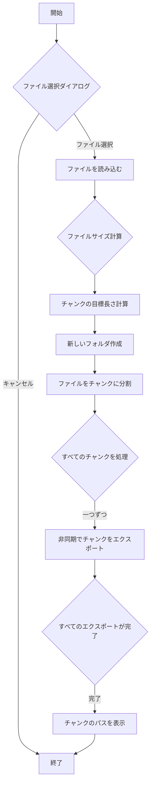

```mermaid
flowchart TD
    A[開始] --> B{ファイル選択ダイアログ}
    B -->|ファイル選択| C[ファイルを読み込む]
    B -->|キャンセル| Z[終了]
    C --> D{ファイルサイズ計算}
    D --> E[チャンクの目標長さ計算]
    E --> F[新しいフォルダ作成]
    F --> G[ファイルをチャンクに分割]
    G --> H{すべてのチャンクを処理}
    H -->|一つずつ| I[非同期でチャンクをエクスポート]
    I --> J{すべてのエクスポートが完了}
    J -->|完了| K[チャンクのパスを表示]
    K --> Z
```